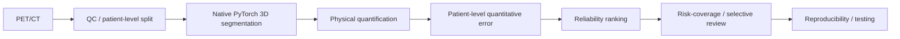

# PET/CT Segmentation, Quantification, and Reliability Engineering


A public-safe engineering path from PET/CT medical imaging and native PyTorch
3D segmentation through physical quantification, patient-level quantitative
error, reliability ranking, and risk--coverage selective review.



## Why this repository exists

This engineering / methodology repository explores how PET/CT segmentation
outputs can connect to physical quantitative endpoints and patient-level
reliability evaluation, rather than treating segmentation overlap as the only
endpoint. It is not a clinical validation study.

## Core technical evidence

- Native PyTorch 3D segmentation: dataset -> 3D U-Net -> loss -> backward pass -> optimizer update.
- Patient-level split checks and PET/CT geometry and segmentation-label QC.
- Physical binary-mask volume calculation from voxel spacing in millimetres.
- Patient-level quantitative-error and reliability utilities with explicit edge-case policies.
- Risk--coverage evaluation with fixed-seed random, non-deployable best-case reference, and reverse controls.
- Automated tests, CI workflows, a public-repository guardrail, provenance utilities, and synthetic demos.

This repository is intentionally modest: it demonstrates public-safe software engineering patterns for PET/CT AI work using synthetic tests and explicit evidence labels. It does not claim that AutoPET, nnU-Net, Blackbean, or TCIA_processing were created here.

## 1. What this repository demonstrates

- Python modules for manifest validation, patient-level split checks, PET/CT spatial QC, segmentation label QC, voxel metrics, lesion metrics, hashing, and run manifests.
- Command-line scripts that call those modules rather than duplicating logic.
- Synthetic tests and a one-command synthetic demo that can run without patient data, GPU access, nnU-Net weights, or external downloads.
- Documentation that separates completed engineering work from planned research.

## 2. Evidence status

| Area | Status | Boundary |
| --- | --- | --- |
| Manifest validation | ENGINEERING_SMOKE | Synthetic CSV tests and demo manifest. |
| Patient-level split validation | ENGINEERING_SMOKE | Synthetic patient keys only. |
| PET/CT geometry QC | ENGINEERING_SMOKE | Synthetic NIfTI images only. |
| Segmentation label QC | ENGINEERING_SMOKE | Synthetic NIfTI masks only. |
| Voxel-level metrics | ENGINEERING_SMOKE | Analytic arrays and synthetic masks. |
| Lesion-level metrics | ENGINEERING_SMOKE | Connected-component tests with synthetic masks. |
| Run provenance helpers | ENGINEERING_SMOKE | Synthetic file hashes and JSON manifests. |
| Physical mask and generic uptake quantification | ENGINEERING_SMOKE | NumPy invariant tests and synthetic methodology demo. |
| Patient-level reliability and risk--coverage | ENGINEERING_SMOKE | Deterministic NumPy tests, controls, and synthetic methodology demo. |
| nnU-Net orchestration wrappers | DEVELOPMENT_EXPOSED | Parameterized wrappers; not run by CI. |
| WinError 1455 and low-VRAM notes | HISTORICAL_PROJECT_RECORD | Historical local records only; not rerun here. |
| Clinical validation | PLANNED | No clinical validation is claimed. |

## 3. Architecture / pipeline

Manifest -> split validation -> PET/CT geometry QC -> segmentation label QC -> 3D segmentation -> physical quantification -> patient-level reliability -> risk--coverage -> run provenance and failure analysis.

Each stage has a small module under `src/pet_ai/` and a corresponding test or demo call. The scripts in `scripts/` are thin command-line entry points.

## 4. Quick Start

```powershell
python -m pip install -e ".[test]"
python -m pytest -q
python -m ruff check .
python scripts/verify_public_repo.py
```

## 5. One-command synthetic demo

```powershell
python scripts/demo_pipeline.py
```

The demo creates temporary synthetic PET, CT, ground-truth mask, and prediction mask files; validates a public-safe manifest; checks splits, geometry, labels, voxel metrics, lesion metrics, and run provenance; then removes temporary imaging files automatically.

## Native PyTorch 3D Baseline

The repository includes a small native PyTorch 3D segmentation baseline for engineering education:

- native `torch.utils.data.Dataset` with synthetic PET/CT tensors
- small 3D U-Net using `Conv3d`, pooling, transposed convolution, and skip connections
- BCE-with-logits plus soft Dice segmentation loss
- explicit training loop with `loss.backward()` and `optimizer.step()`
- unit tests for backward gradients and optimizer parameter updates
- CPU synthetic demonstration in `scripts/demo_pytorch_train.py`

Evidence boundary: this is a synthetic engineering demonstration only. It is not a clinical model, not a performance benchmark, and makes no clinical performance claims.

Install the pinned public PyTorch dependency and test tools, then run the CPU demo:

```powershell
python -m pip install -e ".[test,pytorch]"
python scripts/demo_pytorch_train.py --device cpu
```

## 6. Data and patient-level split validation

`pet_ai.data.manifest` validates required public-safe fields and rejects obvious patient/private fields. `pet_ai.data.split_validation` checks that the same `patient_key` does not appear across train, validation, and test splits.

Development-exposed data must not be described as an independent test set.

## 7. PET/CT spatial and label QC

`pet_ai.qc.geometry` compares NIfTI shape, voxel spacing, orientation, and affine. `pet_ai.qc.labels` checks binary segmentation labels, NaN/Inf values, optional non-empty masks, and optional geometry alignment to a reference image.

The QC modules report problems. They do not silently resample, repair, or exclude cases.

## 8. Voxel-level segmentation evaluation

`pet_ai.evaluation.segmentation` reports TP, FP, FN, Dice, FPV_mL, and FNV_mL. For empty ground truth, Dice is undefined (`NaN`) rather than forced to 1. Negative cases should be reviewed using false-positive volume.

## 9. Lesion-level evaluation

`pet_ai.evaluation.lesion_metrics` identifies 3D connected components in ground truth and prediction, measures lesion volumes in mL, and performs deterministic one-to-one overlap matching. Split/merge ambiguity is reported explicitly because overlap alone cannot determine biological lesion identity in those cases.

## 10. Reproducibility

`pet_ai.reproducibility.hashing` computes SHA256 file hashes. `pet_ai.reproducibility.run_manifest` records command, exit status, Git commit when available, file hashes, Python/platform details, seed, optional GPU name, optional checkpoint hash, and notes.

## 11. Debugging / failure analysis

`docs/FAILURE_ANALYSIS.md` documents evidence-supported historical failures and separates software bugs, environment failures, resource failures, and scientific/model failures.

## 12. nnU-Net orchestration

`scripts/train_nnunet.ps1` and `scripts/infer_nnunet.ps1` are wrappers around upstream nnU-Net commands. They require explicit parameters and environment variables. CI does not train, infer, download weights, or require a GPU.

## 13. Research extensions - PLANNED ONLY

The following remain PLANNED unless future evidence is added: multi-center OOD, multi-tracer OOD, FDG -> PSMA transfer, validated SUV error, and study-defined tumor-volume biomarkers. The v0.3 reliability utilities are synthetic engineering evidence, not clinical evidence.

## 14. Evidence boundaries

Public tests and demos use synthetic data only. This repository does not contain patient images, PHI, raw clinical spreadsheets, DICOM metadata dumps, model weights, checkpoints, private logs, or secrets. Engineering smoke tests are not clinical validation.

## 15. Third-party attribution

AutoPET, nnU-Net, Blackbean, and TCIA_processing are upstream or third-party work. See `THIRD_PARTY.md` for attribution boundaries.
